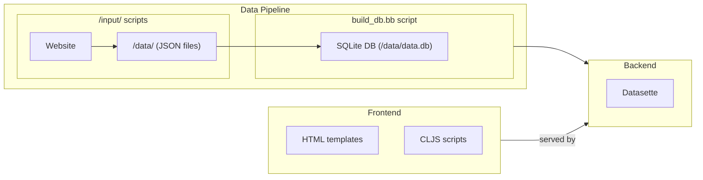

# LacunaDB

This repository contains Singapore legal data obtained various public sources and converted into a machine-readable format, including the following:

- Court hearings: [`/data/hearings.json`](./data/hearings.json)
- Senior Counsels: [`/data/sc.json`](./data/sc.json)
- PDPC undertakings: [`/data/pdpc-undertakings.json`](./data/pdpc-undertakings.json)
- PDPC decisions: [`/data/pdpc-decisions.json`](./data/pdpc-decisions.json)
- LSS DT reports: [`/data/lss-dt-reports.json`](./data/lss-dt-reports.json)
- State Court judgments [`/data/stc-judgments.json`](./data/stc-judgments.json)
- Family Court and Juvenile Court judgments [`/data/fc-judgments.json`](./data/fc-judgments.json)

You can view and query the data using [this Datasette instance](https://lacunadb.huey.xyz/data).

The code and configuration files in this repository are licensed under the EUPL-1.2 as set out in the [LICENCE](./LICENCE) file.

This repository is not affiliated with the Singapore Academy of Law, Singapore Courts, Law Society, or any government agency, and is provided for convenience only.

## Architecture



### Frontend

See [`/app/README.md`](./app/README.md) for frontend development.

### Data pipeline

In the data pipeline, everything is just a script (aka a microservice™). Although most of the scripts are [Babashka](https://github.com/babashka/babashka) scripts written in [Clojure](https://clojure.org/), new scripts can be in any language. 

The data is obtained periodically via scheduled GitHub action workflows and committed to this repository. Each Github Action runs one of the input scripts in the [`/input` folder](./input/). Each input script stores the data obtained in a JSON file in the [`/data` folder](./data/). Each JSON file is just a snapshot in time, i.e. it contains only the data obtained in the last run of the respective script as opposed to all data ever obtained using that script. 

The [`/.github/workflows/deploy.yml`](./.github/workflows/deploy.yml) runs the [`/scripts/build_db.bb`](./scripts/build_db.bb) script which uses the [`git-history`](https://github.com/simonw/git-history) tool to create a SQLite database from the historical data across all the commits in this repository. The script then builds a [Datasette](https://datasette.io/) Docker image and deploys that via [Fly.io](https://fly.io/).

Some of the scripts in the `/scripts` folder run Python tools. This project uses [Poetry](https://github.com/babashka/babashka) to manage its [Python](https://www.python.org/) dependencies, so do install Poetry and the dependencies before running those scripts. 

#### Setup

Make sure you have [Babashka]((https://github.com/babashka/babashka)), [Python](https://www.python.org/), and [Poetry](https://github.com/babashka/babashka) installed.

Install the Poetry dependencies by running `poetry install --no-root`. 

This project uses various CLI utilities, which you will need to install to run the input scripts:

##### pdftotext

[`pdftotext`](https://manpages.ubuntu.com/manpages/lunar/en/man1/pdftotext.1.html) is used to extract text from PDFs. It is bundled within [`poppler`](https://en.wikipedia.org/wiki/Poppler_(software)).

On Ubuntu/Debian:

```bash
sudo apt install poppler-utils
```

On macOS, you can install it using [Homebrew](https://formulae.brew.sh/formula/poppler):

```shell
brew install poppler
```

##### ocrmypdf

[`ocrmypdf`](https://ocrmypdf.readthedocs.io/en/latest/) is used to run OCR on PDFs. It is a Poetry dependency already, but it does require [`tesseract`](https://github.com/tesseract-ocr/tesseract) and [`ghostscript`](https://www.ghostscript.com/) to be installed.

On Ubuntu/Debian:

```bash
sudo apt install tesseract-ocr ghostscript
```

On macOS:

```shell
brew install tesseract ghostscript
```


#### Local development

After cloning this repository and following [the setup steps above](#setup), you can generate the SQLite database on your machine by running the [`/scripts/build_db.bb` script](./scripts/build_db.bb):

```bash
bb --main scripts.build-db
```

If you do not have SQLite installed, you will need to install it.

On Ubuntu/Debian:

```bash
sudo apt install sqlite3
```

On macOS:

```shell
brew install sqlite3
```


This may take some time (possibly >1h) as there have been many commits to this repository. The `build_db.bb` script also does some processing on the data, e.g. it creates and populates certain columns for ease of use based on the raw data (see e.g. [`/scripts/computed_columns.bb`](./scripts/computed_columns.bb)). Alternatively, you can download a copy of the database from [lacunadb.huey.xyz](https://lacunadb.huey.xyz/).

### Backend

Once you have the SQLite data, you can analyse it by running [Datasette](https://datasette.io/) locally. You can use the [`/scripts/dev_docker.bb` script](./scripts/dev_docker.bb). 

```bash
cd lacunadb
bb ./scripts/dev_docker.bb
```

It may be helpful to refer to the Docker images or the GitHub actions for a better idea of how the project functions and how to run certain scripts.
